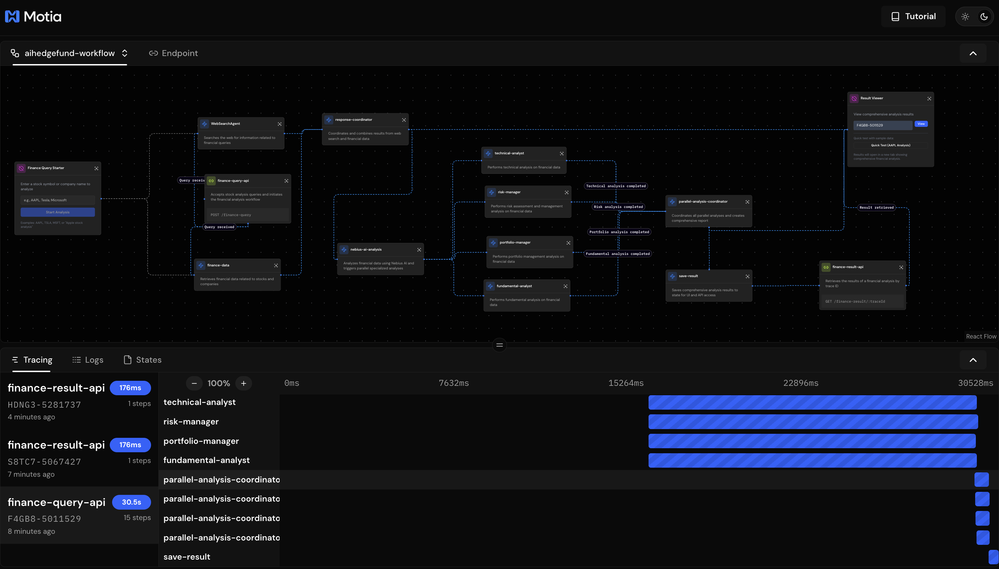
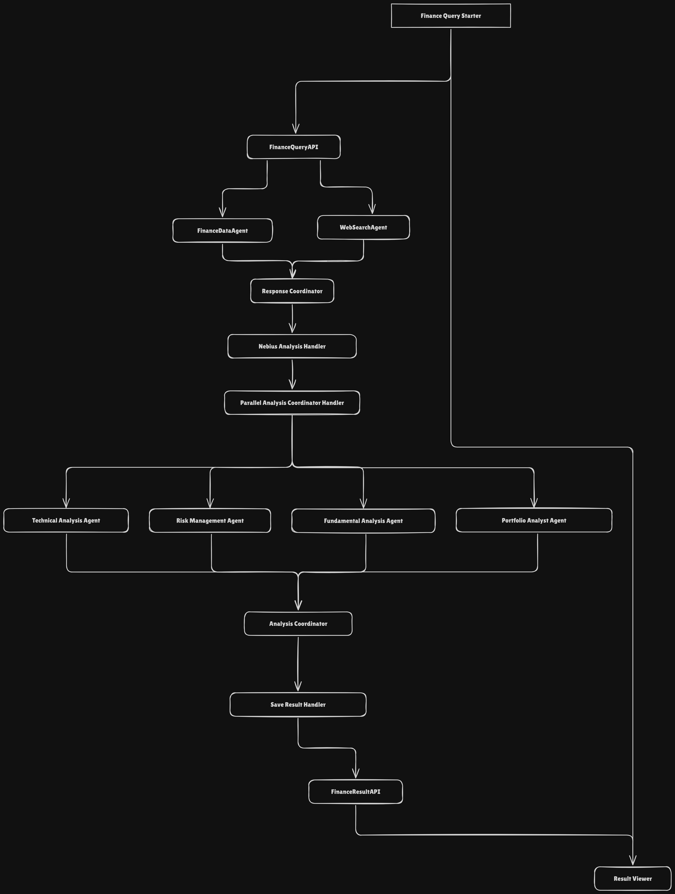
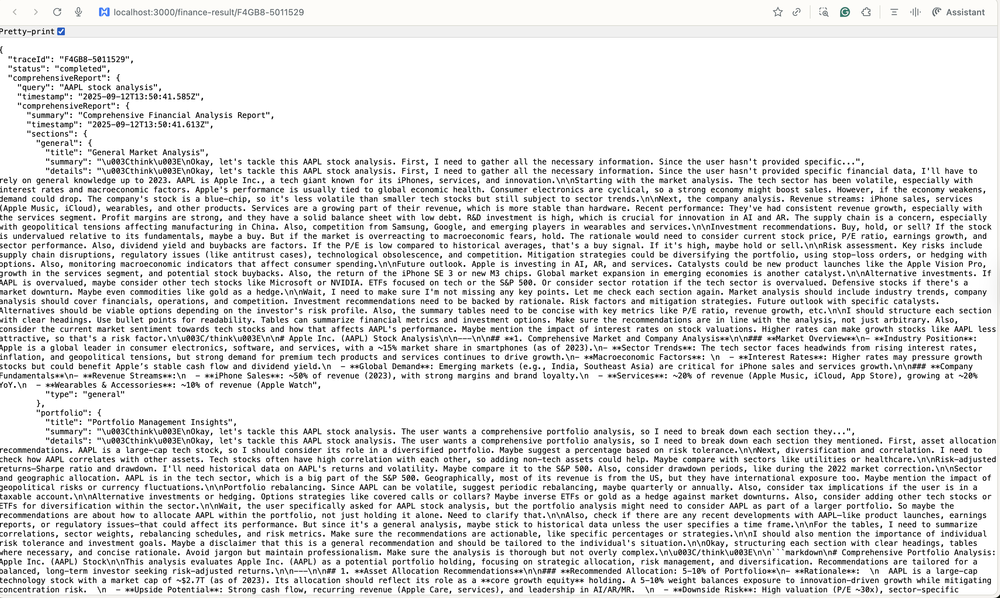

# AI Hedge Fund - Comprehensive Financial Analysis Workflow

A sophisticated Motia-based workflow powered by Nebius Ai Studio that performs comprehensive financial analysis using multiple specialized AI agents, web search, and real-time market data.

## 🏗️ Architecture Overview

This workflow provides end-to-end financial analysis with:
- **Parallel Processing**: Multiple specialized analysis agents run simultaneously
- **Real-time Data**: Web search + financial market data integration
- **AI-Powered Insights**: Nebius AI for comprehensive analysis
- **State Management**: Persistent data across workflow steps
- **Interactive UI**: Custom React components for user interaction

## 📁 Project Structure

```text
ai-hedgefund/
├── services/
│   ├── nebius-ai/
│   │   ├── FinanceDataService.ts
│   │   └── NebiusAIService.ts
│   ├── types.ts
│   └── utils/
│       ├── ConfigService.ts
│       ├── helper-functions.ts
│       ├── ServiceFactory.ts
│       ├── StateService.ts
│       └── WebSearchService.ts
├── steps/
│   ├── api/
│   │   ├── query-api.step.ts
│   │   └── result-api.step.ts
│   ├── general/
│   │   ├── finance-data.step.ts
│   │   ├── nebius-ai-analysis.step.ts
│   │   ├── response-coordinator.step.ts
│   │   ├── save-result.step.ts
│   │   └── web-search.step.ts
│   ├── noop/
│   │   ├── 00-noop.step.ts
│   │   ├── 00-noop.step.tsx
│   │   ├── 01-noop.step.ts
│   │   └── 01-noop.step.tsx
│   └── parallel/
│       ├── fundamental-analyst.step.ts
│       ├── parallel-analysis-coordinator.step.ts
│       ├── portfolio-manager.step.ts
│       ├── risk-manager.step.ts
│       └── technical-analyst.step.ts

```

## 🔄 AI Hedge Fund Workflow



## 🔄 Architecture


## 🚀 Usage

### Starting the Workflow
1. **Via UI**: Use the Finance Query Starter component in the Motia Workbench
2. **Via API**: Send POST request to `/finance-query` with query payload
3. **Via NOOP**: Manually trigger the workflow through the NOOP step

### Example API Request
```bash
curl -X POST http://localhost:3000/finance-query \
  -H "Content-Type: application/json" \
  -d '{"query": "AAPL stock analysis"}'
```

### Retrieving Results
```bash
curl http://localhost:3000/finance-result/{traceId}
```

## ▶︎ Sample Output


## 🐳 Docker Deployment

### Setup Environment Variables
1. Copy the example environment file:
```bash
cp env.example .env
```

2. Edit `.env` and add your API keys:
```bash
# Required
NEBIUS_API_KEY=your_actual_nebius_api_key
NEBIUS_BASE_URL=https://api.studio.nebius.com/v1/
NEBIUS_MODEL=Qwen/Qwen3-14B

ALPHA_VINTAGE_KEY=your_alpha_vintage_api_key_here
SERPER_API_KEY=your_serper_api_key_here 
```

### Installation & Setup

```bash
# Clone the repository
git clone https://github.com/Arindam200/awesome-ai-apps.git
cd advance_ai_agents/ai-hedgefund

# Install dependencies
npm install

# Start the development server
npm run dev
```

### Run with Docker Compose

```bash
# Start the application
docker compose up -d

# View logs
docker compose logs -f

# Stop the application
docker compose down
```

### Run with Environment Variables Directly

```bash

# Or export them first
export NEBIUS_API_KEY=your_key
export OPENAI_API_KEY=your_key
docker compose up -d
```

### Simple Docker Build & Run

```bash
# Build the image
docker build -t ai-hedgefund .

# Run with environment variables
docker run -p 3000:3000 -e NEBIUS_API_KEY=your_key ai-hedgefund
```

## 🔧 Key Features

### Parallel Processing
- **Web Search + Financial Data**: Simultaneous data collection
- **Specialized Analyses**: 4 parallel AI analysis agents (Fundamental, Portfolio, Risk, Technical)
- **Coordinated Results**: Smart coordination of parallel processes

### State Management
- **Persistent Storage**: Data persists across workflow steps
- **Multiple Access Patterns**: Results stored in multiple locations
- **Trace Isolation**: Each workflow run has isolated state

### Error Handling
- **Graceful Degradation**: Continues processing even if some analyses fail
- **Comprehensive Logging**: Structured logging with trace IDs
- **Error Events**: Dedicated error topics for monitoring

### Type Safety
- **Zod Validation**: Input validation for all steps
- **TypeScript Types**: Full type safety across the workflow
- **Structured Data**: Consistent data structures throughout

## 📊 Analysis Types

1. **General Analysis**: Overall market and company overview using Nebius AI
2. **Fundamental Analysis**: Valuation, financial ratios, growth prospects
3. **Portfolio Analysis**: Investment recommendations, allocation strategies
4. **Risk Analysis**: Risk assessment, volatility analysis, downside protection
5. **Technical Analysis**: Chart patterns, technical indicators, price trends

## 🎯 Workflow Benefits

- **Comprehensive Insights**: Multiple analysis perspectives
- **Real-time Data**: Live market data integration
- **AI-Powered**: Advanced AI analysis capabilities
- **Scalable**: Parallel processing for performance
- **Reliable**: State management and error handling
- **Interactive**: Custom UI components for user interaction

This workflow provides a complete financial analysis solution with enterprise-grade reliability and comprehensive insights.