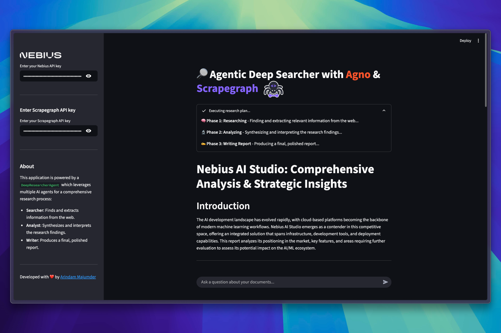
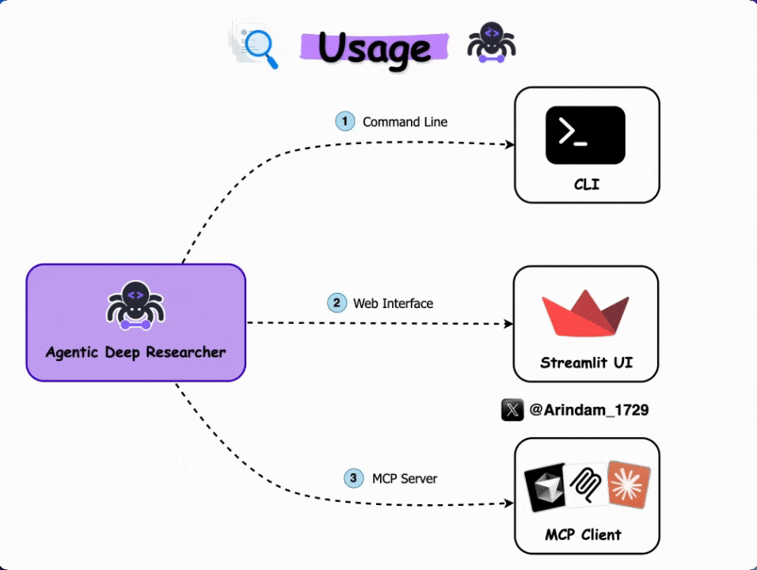
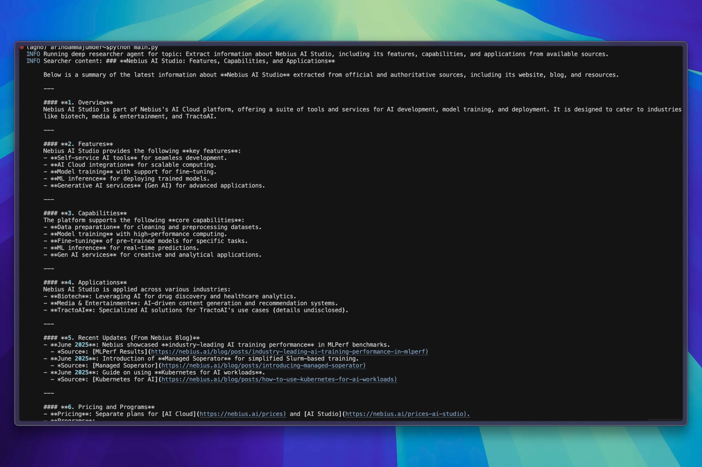
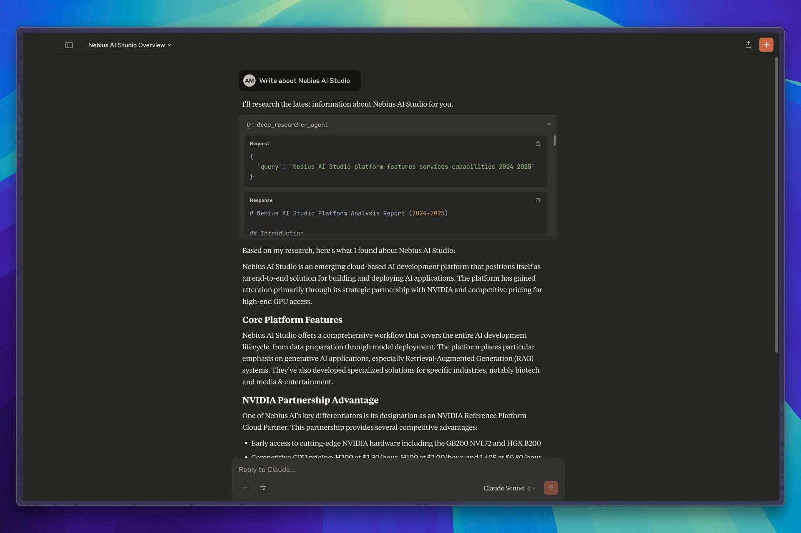

# Deep Researcher Agent



A multi-stage AI-powered research workflow agent that automates comprehensive web research, analysis, and report generation using Agno, Scrapegraph, and Nebius AI.


## Features

- **Multi-Stage Research Workflow**: Automated pipeline for searching, analyzing, and reporting
- **Web Scraping**: Advanced data extraction with Scrapegraph
- **AI-Powered Analysis**: Uses Nebius AI for intelligent synthesis
- **Streamlit Web UI**: Modern, interactive interface
- **MCP Server**: Model Context Protocol server for integration
- **Command-Line Support**: Run research tasks directly from the terminal

## How It Works


1. **Searcher**: Finds and extracts high-quality, up-to-date information from the web using Scrapegraph and Nebius AI.
2. **Analyst**: Synthesizes, interprets, and organizes the research findings, highlighting key insights and trends.
3. **Writer**: Crafts a clear, structured, and actionable report, including references and recommendations.

> **Workflow:**
>
> - Input a research topic or question
> - The agent orchestrates web search, analysis, and report writing in sequence
> - Results are presented in a user-friendly format (web or CLI)


## Prerequisites

- Python 3.10+
- [uv](https://github.com/astral-sh/uv) for dependency management
- API keys for [Nebius AI](https://dub.sh/nebius) and [Scrapegraph](https://dub.sh/scrapegraphai)


## Installation

Follow these steps to set up the **Deep Researcher Agent** on your machine:

1. **Install `uv`** (if you don’t have it):

   ```bash
   curl -LsSf https://astral.sh/uv/install.sh | sh
   ```

2. **Clone the repository:**

   ```bash
   git clone https://github.com/Arindam200/awesome-ai-apps.git
   ```

3. **Navigate to the Deep Researcher Agent directory:**

   ```bash
   cd awesome-ai-apps/advance_ai_agents/deep_researcher_agent
   ```

4. **Install all dependencies:**

   ```bash
   uv sync
   ```

## Environment Setup

Create a `.env` file in the project root with your API keys:

```env
NEBIUS_API_KEY=your_nebius_api_key_here
SGAI_API_KEY=your_scrapegraph_api_key_here
```


## Usage



You can use the Deep Researcher Agent in three ways. Each method below includes a demo image so you know what to expect.

### Web Interface

Run the Streamlit app:

```bash
uv run streamlit run app.py
```

Open your browser at [http://localhost:8501](http://localhost:8501)

What it looks like:


### Command Line

Run research directly from the command line:

```bash
uv run python agents.py
```

What it looks like:



### MCP Server

Add the following configuration to your .cursor/mcp.json or Claude/claude_desktop_config.json file (adjust paths and API keys as needed):

```json
{
  "mcpServers": {
    "deep_researcher_agent": {
      "command": "python",
      "args": [
        "--directory",
        "/Your/Path/to/directory/awesome-ai-apps/advance_ai_agents/deep_researcher_agent",
        "run",
        "server.py"
      ],
      "env": {
        "NEBIUS_API_KEY": "your_nebius_api_key_here",
        "SGAI_API_KEY": "your_scrapegraph_api_key_here"
      }
    }
  }
}
```

This allows tools like Claude Desktop to manage and launch the MCP server automatically.




## Project Structure

```
deep_researcher_agent/
├── app.py              # Streamlit web interface
├── agents.py           # Core agent workflow
├── server.py           # MCP server
├── assets/             # Static assets (images)
├── pyproject.toml      # Project configuration
└── README.md           # This file
```

---

## Development

### Code Formatting

```bash
uv run black .
uv run isort .
```

### Type Checking

```bash
uv run mypy .
```

### Testing

```bash
uv run pytest
```

---

## Contributing

Contributions are welcome! Please feel free to submit a Pull Request or open an issue.

---

## Acknowledgments

- [Agno](https://www.agno.com/) for agent orchestration
- [Scrapegraph](https://dub.sh/scrapegraphai) for web scraping
- [Nebius AI Studio](https://studio.nebius.com/) for AI model access
- [Streamlit](https://streamlit.io/) for the web interface


## Author

Developed with ❤️ by [Arindam Majumder](https://www.youtube.com/c/Arindam_1729)
