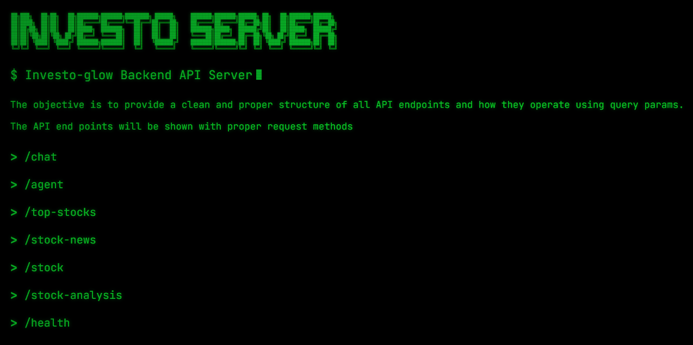

[](https://investo-server-v86v.onrender.com/)

---

[](https://hub.docker.com/r/yashksaini19/investo-agno-server)


A FastAPI REST API server built using FastAPI and Agno AI. The server configuration has routes handlers to fetch latest data of the stock tickers. It also interacts with the Agno AI to get the predictions for the stock prices, answers to the queries, and use tools like `search`, `get_stock_data`, and `get_stock_price`.


## Tech Stack

<table>
    <tr>
        <td></td>
        <td>FastAPI is a modern, fast (high-performance), web framework for building APIs with Python 3.6+ based on standard Python type hints.</td>
    </tr>
    <tr>
        <td></td>
        <td>Agno is a lightweight library for building multi-modal Agents.
</td>
    </tr>
    <tr>
        <td></td>
        <td>Render is a cloud provider that makes deploying your code as easy as deploying to localhost. You can deploy anything that runs on a single port.</td>
    </tr>
    <tr>
        <td></td>
        <td>Docker is a set of platform as a service products that use OS-level virtualization to deliver software in packages called containers</td>
    </tr>
    <tr>
        <td></td>
        <td>Redis is a free, open-source, in-memory database that stores data as key-value pairs. It's often used as a cache, message broker, or database for quick responses.</td>
    </tr>
</table>

---

## Deployment

The backend server can be locally deployed using Docker. Use the following command to build and run the server:

- **Build the Docker image**

```bash
docker-compose build
```

- **Run the Docker container**

```bash
docker-compose up
```

- **Access the server**

```bash
http://localhost:8000/
```

### API Documentation

The API documentation is available at the following URL:

```bash
http://localhost:8000/docs
```
### Environment Variables
The following environment variables are required to run the server:

```bash
NEWS_API_KEY: Your News API key for fetching news articles.
REDIS_URL: The URL of the Redis server for caching.
NEBIUS_API_KEY: Your Nebius model API key for AI predictions.
```

---


<h2>Developers</h2>
<div align="center">    
<table>
    <tbody>
        <tr>
            <td align="center" width="33.33%">
                
                <br/>
                <h4 align="center">
                    <b>Yash K. Saini</b>
                </h4>
                <div align="center">
                    <p>Lead Developer</p>
                    <a href="https://linkedin.com/in/yashksaini"></a>
                    <a href="https://twitter.com/yash_k_saini"></a>
                    <a href="https://github.com/yashksaini-coder"></a>
                </div>
            </td>
            <td align="left" valign="middle" width="70%">
                <ul>
                    <li>
                        A self-taught software developer and a computer science student from India.
                    </li>
                    <li>
                        Building products & systems that can benefit & solve problems for many other DEVs.
                    </li>
                    <li>
                        Passionate about AI, Open Source, and building scalable systems.
                    </li>
                </ul>
            </td>
        </tr>
    </tbody>
</table>
