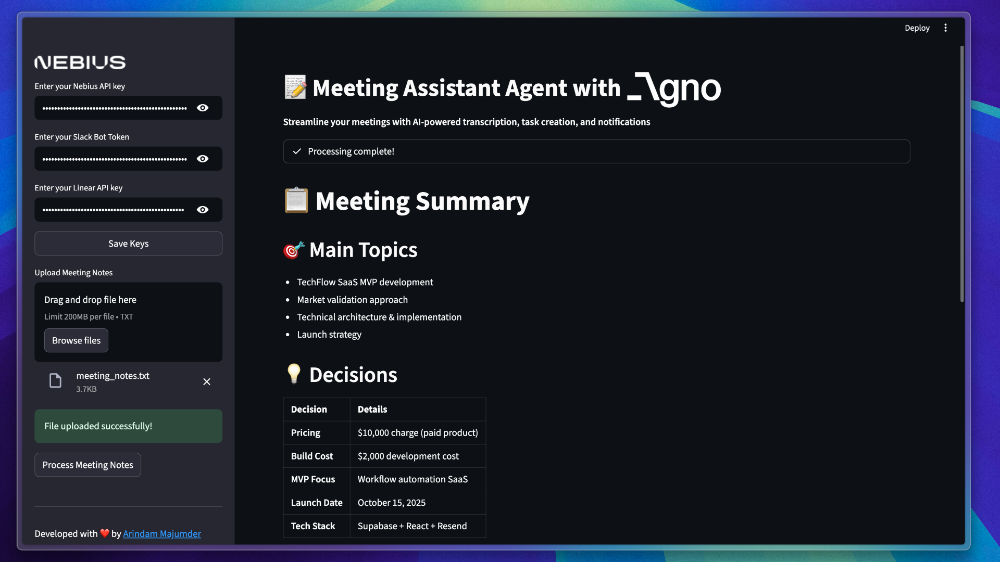

# Meeting Assistant Agent with Agno, Slack & Linear

The Meeting Assistant Agent is a powerful tool designed to streamline the process of managing meeting notes, creating actionable tasks, and sending notifications. It leverages advanced AI agents to enhance productivity and ensure that key decisions and tasks are captured effectively.

## Project Structure

```text
meeting_assistant_agent
├── assets                  # Image asset used in the Streamlit user interface
├── main.py                 # Core logic for the Meeting Assistant agent
├── app.py                  # Streamlit user interface for the Meeting Assistant agent
├── requirements.txt        # List of dependencies required for the project
└── README.md               # Documentation for the project
```

## Features

- **Meeting Transcription**: Automatically transcribes meeting notes into a clean, readable summary.
- **Task Creation**: Generates actionable tasks in Linear based on meeting discussions.
- **Slack Notifications**: Sends informative summaries and notifications to a designated Slack channel.
- **Summary Generation**: Provides concise summaries of meetings, highlighting key decisions and next steps.

## Installation

1. Clone the repository:

   ```bash
   git clone https://github.com/Arindam200/awesome-ai-apps.git
   cd advance_ai_agents/meeting_assistant_agent
   ```

2. Install the required dependencies:

   ```bash
   uv sync
   ```

3. Set up environment variables:
   - Create a `.env` file in the project root and add your API keys:

     ```bash
     NEBIUS_API_KEY=<your_nebius_api_key>
     SLACK_BOT_TOKEN=<your_slack_bot_token>
     LINEAR_API_KEY=<your_linear_api_key>
     ```

## Usage

1. Run the Streamlit application:

   ```bash
   uv run streamlit run app.py
   ```

2. Open your web browser and navigate to `http://localhost:8501`.

3. Enter your API keys in the sidebar and input your meeting notes in the chat input.

4. The application will process the meeting notes, create tasks, and send notifications as specified.

## Contributing

Contributions are welcome! Please feel free to submit a pull request or open an issue for any enhancements or bug fixes.

## License

This project is licensed under the MIT License. See the LICENSE file for more details.