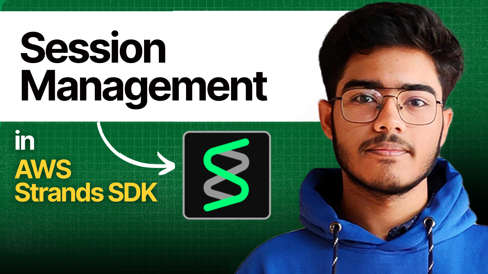

# Lesson 2: Sessions & State in AWS Strands

In this lesson, you'll learn how to give your agent a memory. By default, an agent is stateless—it forgets everything after providing a response. Session management allows an agent to remember past interactions, maintain context, and have more natural, ongoing conversations.

We'll use a `FileSessionManager` to automatically save and load the conversation history to your local computer.

---

### Key Concepts Explained

1.  **`FileSessionManager`**: This is the component that handles the agent's memory. We create an instance of it with two key parameters:
    -   `session_id`: A unique string that identifies a specific conversation. You can have many different sessions, each with its own memory.
    -   `storage_dir`: The folder on your computer where the conversation history will be saved as JSON files.

2.  **Agent with Memory**: We simply pass the `session_manager` instance to the `Agent` constructor. The agent automatically uses it to save every message (both user and assistant) and load the history every time it's called with the same `session_id`.

3.  **Conversational Context**: Because the agent loads the previous messages, it has the full context of the conversation. When the user asks, "Do you remember my name?", the agent can look back at the history, see that the user previously said "my name is Arindam," and provide the correct answer.

### How It Works Under the Hood

The `FileSessionManager` creates a folder for each `session_id`. Inside that folder, it saves each message in the conversation as a separate JSON file. When you create an agent with an existing `session_id`, the manager loads all those JSON files to reconstruct the conversation history before the agent starts processing the new query.

---

### Further Learning

-   **Watch the Video:** [AWS Strands Course Playlist](https://www.youtube.com/playlist?list=PLMZM1DAlf0Lrc43ZtUXAwYu9DhnqxzRKZ)
-   **Read the Docs:** [Official Strands Documentation](https://strandsagents.com/latest/documentation/docs/)

---

### Navigation

| Previous Lesson | Next Lesson |
| :-------------- | :---------- |
| [Lesson 1: Basic Agent](/course/aws_strands/01_basic_agent) | [Lesson 3: Structured Output](/course/aws_strands/03_structured_output) |