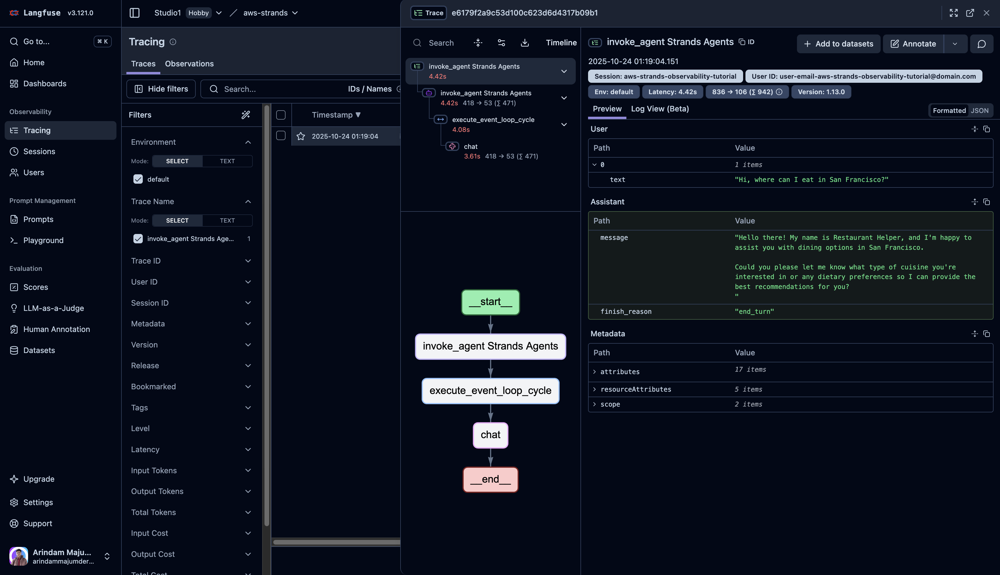
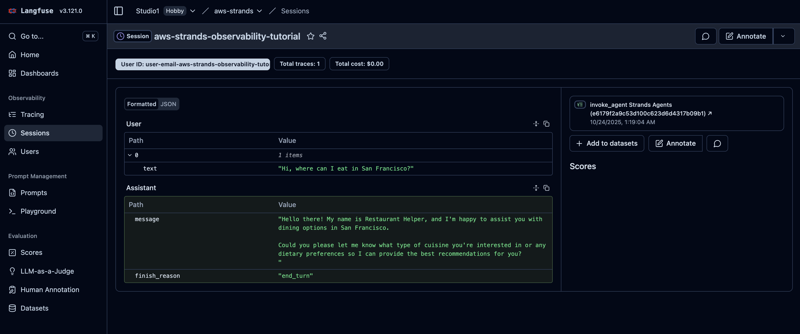

# Lesson 7: Observability Agent

Observability is crucial for monitoring and debugging AI agents in production. This lesson demonstrates how to implement comprehensive observability using AWS Strands with Langfuse integration and OpenTelemetry tracing.

### What You'll Learn

- How to configure OpenTelemetry for AI agent observability
- Setting up Langfuse for tracing and monitoring
- Monitoring agent interactions and performance
- Best practices for AI application observability

### Prerequisites

- Basic understanding of AWS Strands framework
- Python environment with required dependencies
- API key for your chosen language model (Nebius, OpenAI, etc.)
- Langfuse account for observability

## Use Cases

Observability patterns are essential for several real-world scenarios:

### 📊 **Performance Monitoring**

- **Response time tracking**: Monitor how long each interaction takes
- **Token usage monitoring**: Track costs and efficiency metrics
- **Error rate analysis**: Identify and debug failed requests
- **Resource utilization**: Monitor system performance

### 🔍 **Debugging and Troubleshooting**

- **Distributed tracing**: Follow requests through the entire system
- **Error tracking**: Identify where and why failures occur
- **Log aggregation**: Centralized logging for easier debugging
- **Session tracking**: Monitor user interactions over time

### 📈 **Business Intelligence**

- **Usage analytics**: Understand how users interact with your agent
- **Cost analysis**: Track and optimize operational costs
- **Quality metrics**: Monitor response quality and user satisfaction
- **Custom metrics**: Track business-specific KPIs

### 🛡️ **Security and Compliance**

- **Audit trails**: Track all agent interactions for compliance
- **Security monitoring**: Detect suspicious patterns or attacks
- **Data privacy**: Ensure sensitive data is handled properly
- **Access control**: Monitor who is using the system

---

## Implementation

### Code: `main.py`

This script demonstrates how to set up observability for an AI agent:

1. **Environment Setup**: Validates required environment variables
2. **OpenTelemetry Configuration**: Sets up tracing for Langfuse
3. **Agent Creation**: Creates an agent with observability features
4. **Interaction Monitoring**: All interactions are automatically traced

### Key Components

The implementation consists of:

- **Environment validation**: Ensures all required variables are set
- **Langfuse integration**: Configures OpenTelemetry for tracing
- **Agent configuration**: Sets up tracing attributes and monitoring
- **Interaction demonstration**: Shows how interactions are monitored

## Key Concepts

### 🔧 **OpenTelemetry Integration**

OpenTelemetry provides standardized observability by automatically instrumenting your agent with:

- **Distributed tracing**: Complete request flows
- **Metrics collection**: Performance and usage data
- **Log correlation**: Links logs to specific traces

### 📊 **Langfuse Monitoring**

Langfuse provides a comprehensive observability platform with:

- **Trace visualization**: See complete request flows
- **Session tracking**: Monitor conversation sessions
- **Performance metrics**: Response times, token usage, costs
- **Custom dashboards**: Business-specific monitoring


_Complete request tracing showing the flow from user input to agent response_


_Session monitoring dashboard showing conversation history and user interactions_

### 🏷️ **Trace Attributes**

Custom attributes provide context for monitoring:

| Attribute       | Description               | Example                          |
| --------------- | ------------------------- | -------------------------------- |
| `session.id`    | Unique session identifier | "user-session-123"               |
| `user.id`       | User identification       | "user@example.com"               |
| `langfuse.tags` | Categorization tags       | ["production", "restaurant-bot"] |

### 📈 **Monitoring Metrics**

Key metrics to track:

- **Response Time**: How long each interaction takes
- **Token Usage**: Cost and efficiency metrics
- **Error Rate**: Frequency of failed requests
- **User Satisfaction**: Based on interaction patterns

## Quick Start

### 1. **Setup Environment**

```bash
# Install dependencies
uv sync

# Set up your environment variables
export NEBIUS_API_KEY="your-api-key-here"
export LANGFUSE_PUBLIC_KEY="your-langfuse-public-key"
export LANGFUSE_SECRET_KEY="your-langfuse-secret-key"
export LANGFUSE_HOST="https://cloud.langfuse.com"
```

### 2. **Run the Example**

```bash
uv run main.py
```

### 3. **Expected Output**

You'll see the agent initialize with observability and demonstrate an interaction that's automatically traced and monitored in Langfuse.

```
🤖 Restaurant Helper Agent initialized with observability!
📊 All interactions will be traced and monitored in Langfuse.
------------------------------------------------------------
👤 User: Hi, where can I eat in San Francisco?
🤖 Restaurant Helper: [Agent response with tracing enabled]
```

The interaction will be automatically captured in Langfuse for monitoring and analysis.

---

## Further Learning

### 📚 **Resources**

- **Video Tutorial**: [AWS Strands Course Playlist](https://www.youtube.com/playlist?list=PLMZM1DAlf0Lrc43ZtUXAwYu9DhnqxzRKZ)
- **Documentation**: [Official Strands Documentation](https://strandsagents.com/latest/documentation/docs/)

---

## Navigation

| ← Previous                                                         | Next →                                          |
| :----------------------------------------------------------------- | :---------------------------------------------- |
| [Multi-Agent Patterns](/course/aws_strands/06_multi_agent_pattern) | [Guardrails](/course/aws_strands/08_guardrails) |
