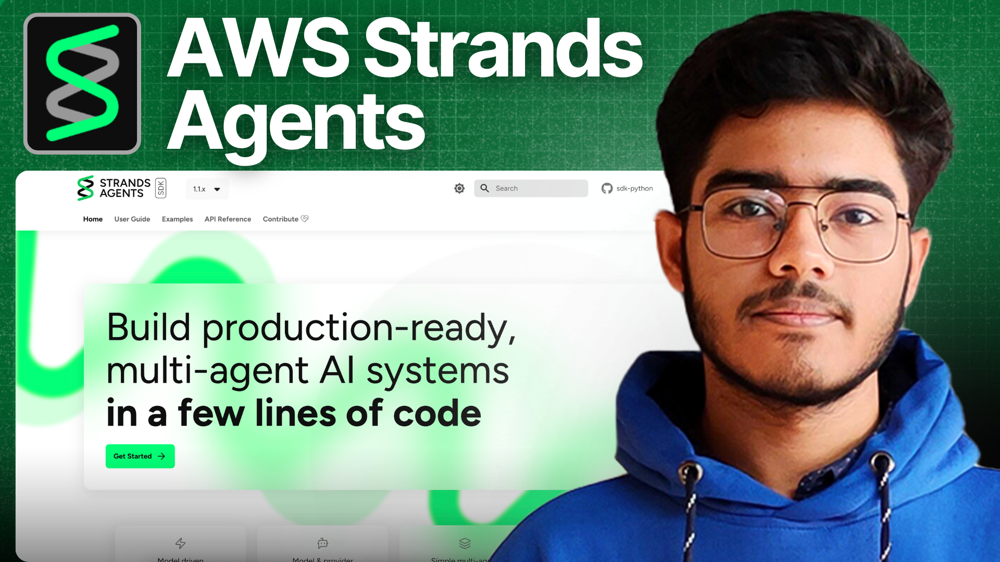

# AWS Strands Course for Beginners

Welcome to this hands-on course on building AI agents with the AWS Strands SDK!

This course will guide you through the fundamentals of creating powerful and flexible AI agents using Strands. We'll start with the basics and progressively build more complex and capable agents.

## Course Structure

This course is divided into several lessons, each focusing on a core concept of the Strands SDK.

### Table of Contents

| Lesson | Topic                                    | Description                                                                                               |
| :----- | :--------------------------------------- | :-------------------------------------------------------------------------------------------------------- |
| 01     | [Basic Agent](./01_basic_agent)          | Learn how to create your first agent, configure a model, and make it perform a simple task using a tool.    |
| 02     | [Session Management](./02_session_management) | Discover how to persist conversations and agent state, allowing for context-aware interactions.           |
| 03     | [Structured Output](./03_structured_output) | Extract structured data (like JSON) from unstructured text using Pydantic models.                         |
| 04     | [MCP Agent](./04_mcp_agent)               | Integrate external tools and services into your agent using the Multi-Capability Protocol (MCP).          |
| 05     | [Human-in-the-Loop](./05_human_in_the_loop_agent) | Learn how to pause agent execution to request human input or approval before continuing.                |
| 06     | [Multi-Agent Patterns](./06_multi_agent_pattern) | Explore advanced patterns for building complex systems with multiple collaborating agents.              |
|        | ↳ [Agent as Tools](./06_multi_agent_pattern/06_1_agent_as_tools) | Build an orchestrator agent that delegates tasks to specialized agents.                                   |
|        | ↳ [Swarm Intelligence](./06_multi_agent_pattern/06_2_swarm_agent) | Create a dynamic group of agents that can hand off tasks to each other to solve complex problems.       |
|        | ↳ [Graph-Based Workflows](./06_multi_agent_pattern/06_3_graph_agent) | Define explicit, structured workflows for multi-agent collaboration using a graph.                      |

## Getting Started

To begin, head over to the `starter_ai_agents/aws_strands_starter` directory and follow the instructions in the `README.md` file. This will help you set up your environment and run your first basic agent.

Happy building!
