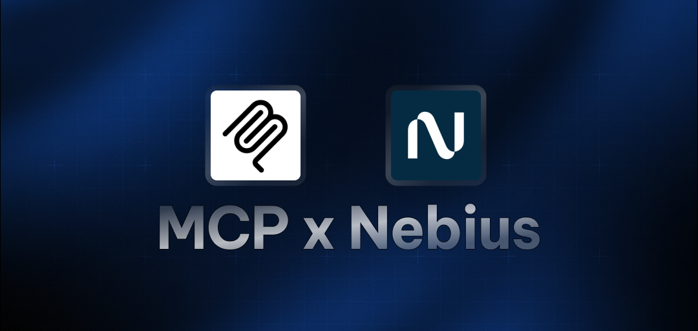

# MCP Starter Agent with Nebius

A GitHub repository analysis tool powered by Nebius AI and the Model Context Protocol (MCP). This tool helps analyze GitHub repositories by providing detailed insights about issues and commits using AI-powered analysis.

## Features

- Analyzes GitHub repositories using AI
- Retrieves and analyzes recent issues
- Examines latest commits
- Powered by Meta-Llama-3.1-8B-Instruct model via Nebius AI

## Prerequisites

- Python 3.x
- GitHub Personal Access Token
- Nebius API Key

## Environment Setup

Create a `.env` file in the project root with the following variables:

```env
GITHUB_PERSONAL_ACCESS_TOKEN=your_github_token
NEBIUS_API_KEY=your_nebius_api_key
```

## Installation

1. Clone the repository
2. Install dependencies:

```bash
pip install -r requirements.txt
```

## Usage

Run the main script:

```bash
python main.py
```

When prompted, enter a GitHub repository URL in the format: `owner/repo`

The tool will:

1. Analyze the most recent issue in the repository
2. Analyze the most recent commit

## How It Works

The tool uses the Model Context Protocol (MCP) to interact with GitHub's API and Nebius AI for analysis. It:

1. Connects to GitHub using your personal access token
2. Uses Nebius AI's Meta-Llama-3.1-8B-Instruct model for intelligent analysis
3. Retrieves and analyzes repository data
4. Provides detailed insights about issues and commits

