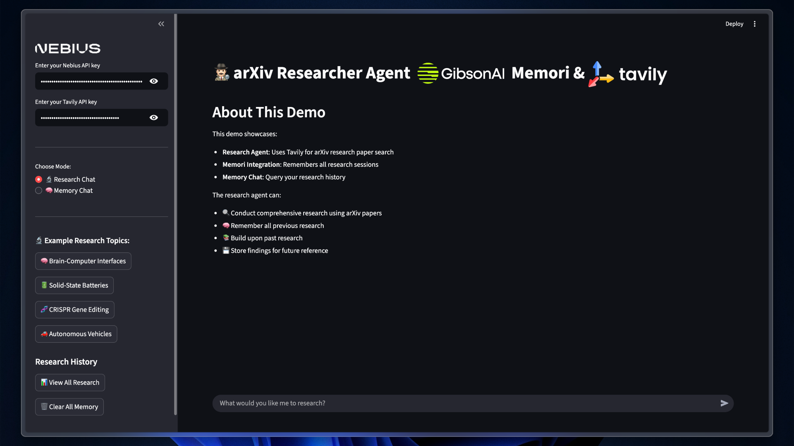

# arXiv Researcher Agent Demo with OpenAI Agents & Memori

An advanced AI research assistant built using OpenAI Agents and Memori memory integration. This demo showcases how to create agents that remember research sessions, build upon previous findings, and provide persistent, organized research support focused on arXiv papers.

## Features

### Agent Capabilities

- **Research Agent**: Conducts arXiv research paper searches, generates comprehensive reports, and saves findings to persistent memory
- **Memory Assistant Agent**: Retrieves, summarizes, and organizes previous research sessions for easy recall

### Memori Memory Integration

- **Persistent Memory**: All research sessions are stored and can be referenced in future interactions
- **Conscious Ingestion**: Automatically identifies and stores important research information
- **Memory Search**: Enables agents to search and build upon previous research

### arXiv Research Integration

- **Tavily Search Tool**: Advanced search for academic research papers and arXiv publications
- **Academic Focus**: Specialized in finding scholarly sources and research papers
- **Fact-Focused Reports**: Ensures all findings are verifiable and properly cited

### Streamlit UI

- **Interactive Web App**: Easy-to-use interface for research and memory queries
- **Chat Modes**: Switch between research and memory assistant agents
- **History & Memory Management**: View, search, and clear research history

### 1. Prerequisites

```bash
# Install Python dependencies
uv sync
```

### 2. API Keys Required

#### Nebius API Key

- Visit [Nebius AI Studio](https://dub.sh/nebius)
- Create a new API key

#### Tavily API Key

- Visit [Tavily Platform](https://dub.sh/tavily)
- Create a new API key
- Copy the key

### 3. Environment Setup

Create a `.env` file in this directory:

```env
NEBIUS_API_KEY="your nebius-api-key-here"  # Replace with your actual Nebius AI API key
TAVILY_API_KEY="your-tavily-api-key-here"  # Replace with your actual Tavily API key
EXAMPLE_MODEL_NAME ="moonshotai/Kimi-K2-Instruct" # Replace with any other supported models
EXAMPLE_BASE_URL= "https://api.studio.nebius.ai/v1"

```

## Usage

### 1. Run the Application

```bash
streamlit run app.py
```

### 2. Research & Memory Features

- **Research Chat**: Ask the agent to research any topic. It will search memory, find relevant arXiv papers, and generate a professional report.
- **Memory Chat**: Query your research history, recall previous topics, and get organized summaries of past findings.
- **History Management**: View all research sessions or clear memory from the sidebar.

## 📋 Example Interactions

### Research Session

```
Input: "Research the latest breakthroughs in quantum computing."

The agent will:
1. Search its memory for previous quantum computing research
2. Use Tavily to find relevant arXiv papers and academic sources
3. Cross-reference sources and generate a comprehensive report
4. Save the session to Memori for future reference
```

### Memory Query

```
Input: "Summarize my research history on AI ethics."

The memory assistant will:
- Search all past research sessions related to AI ethics
- Organize findings chronologically or by topic
- Provide a clear summary and highlight key connections
```

## Research Focus

This agent is specifically designed for academic research and arXiv papers:

- **Academic Sources**: Focuses on scholarly papers, research publications, and academic sources
- **arXiv Integration**: Specialized in finding and analyzing arXiv research papers
- **Research Methodology**: Provides structured analysis of research questions, methods, and findings
- **Academic Standards**: Follows proper citation and academic writing conventions
