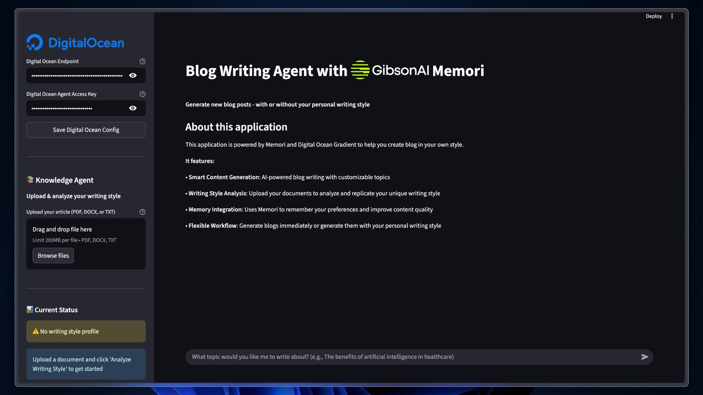

# AI Blog Writing Agent with Digital Ocean & Gibson AI Memori

A powerful AI-powered blog writing tool that analyzes your writing style and generates new content using Digital Ocean AI and GibsonAI. This application allows users to upload their previous articles, analyze their unique writing style, and generate new blog posts that sound exactly like them.

## Features ✨

✍️ **Writing Style Analysis**: Upload your articles to analyse tone, voice, structure, and vocabulary  
🤖 **AI-Powered Content Generation**: Uses Digital Ocean AI to create content in your style  
💾 **Memory Integration**: Stores your writing style profile using Memori for long-term learning  
📚 **Multi-Format Support**: Handles PDF, DOCX, and TXT documents  
🎯 **Style Matching**: Generates content that perfectly matches your writing personality  
📝 **Content Management**: Download, copy, and save generated blog posts  
🔍 **Real-time Analysis**: Instant writing style insights with detailed breakdowns  
⚙️ **Easy Configuration**: Simple setup with API keys and environment variables  
🔒 **Secure Processing**: Local document processing with no external storage  

## Prerequisites 🛠️

- Python 3.10+
- Digital Ocean AI API credentials
- GibsonAI's Memori integration

## Installation 📥

Clone the repository:

```bash
git clone https://github.com/Arindam200/awesome-ai-apps.git
cd simple_ai_agents/blog_writing_agent
```

Install the required dependencies using uv:

```bash
uv sync
```

Create a `.env` file in the project root and add your API credentials:

```env
DIGITAL_OCEAN_ENDPOINT=your_digital_ocean_agent_endpoint
DIGITAL_OCEAN_AGENT_ACCESS_KEY=your_digital_ocean_api_key
```

## Usage 🚀

Start the Streamlit application:

```bash
uv run streamlit run app.py
```

Open your web browser and navigate to the provided local URL (typically http://localhost:8501)

## How It Works 🔄

### 1. **Knowledge Agent (Sidebar)**
- **Upload Document**: Upload your previous articles (PDF, DOCX, or TXT)
- **Style Analysis**: AI analyzes your writing style, tone, and structure
- **Memory Storage**: Automatically stores your style profile in the database

### 2. **Writing Agent (Main Area)**
- **Topic Input**: Enter what you want to write about using the chat interface
- **Content Generation**: AI creates blog posts using your stored writing style
- **Content Management**: Download, copy, and save your generated content

## Example Workflow 🔄

1. **Upload Article**: Upload a blog post that represents your writing style
2. **Analyze Style**: Click "🔍 Analyze Writing Style" to get insights
3. **Style Stored**: Your writing profile is automatically saved to memory
4. **Generate Content**: Use the chat input to request new blog posts
5. **Get Results**: Receive AI-generated content that sounds like you wrote it
6. **Manage Content**: Download, copy, or save your generated posts

## Supported Document Formats 📄

- **PDF**: Portable Document Format files


## Writing Style Analysis 📊

The AI analyzes your writing across multiple dimensions:

- **🎭 Tone**: Formal, casual, professional, friendly, etc.
- **🗣️ Voice**: Authoritative, conversational, technical, etc.
- **📐 Structure**: Paragraph organization, transitions, flow
- **📚 Vocabulary**: Complexity level and word choice patterns
- **📝 Sentence Patterns**: Length, structure, and rhythm
- **💡 Examples Style**: How you use analogies and examples

## API Configuration 🔑

### Digital Ocean AI
- **Agent Endpoint**: Your Digital Ocean AI agent endpoint
- **API Key**: Your Digital Ocean AI access key

### GibsonAI Memori Integration
- **Built-in Support**: Seamless integration with GibsonAI Memori
- **Logo Display**: Prominent branding in the application interface

## Architecture 🏗️

### Modular Design
- **UI Layer (app.py)**: Streamlit interface and user interactions
- **Agent Layer (agents.py)**: AI functions and business logic
- **Memory Layer**: Memori integration for style persistence
- **AI Services**: Digital Ocean AI integration for content generation

### Key Components
- **Document Processor**: Extracts text from various file formats
- **Style Analyzer**: Analyzes writing patterns using AI
- **Content Generator**: Creates new content matching your style
- **Memory Manager**: Stores and retrieves writing style profiles

## Example Use Cases 💡

### Content Creation
- "Write a blog post about artificial intelligence in healthcare"
- "Create an article about sustainable business practices"
- "Generate content about remote work productivity tips"

### Style Learning
- Upload your best blog posts to teach the AI your style
- Analyze multiple articles to build a comprehensive profile
- Refine your style profile over time with new content

## Contributing 🤝

Contributions are welcome! Please feel free to submit a Pull Request.

## License 📄

This project is licensed under the MIT License - see the LICENSE file for details.

## Support 💬

If you encounter any issues or have questions, please open an issue on GitHub.
