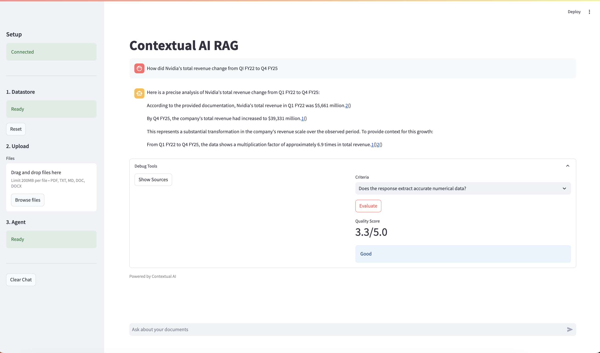

# Contextual AI RAG

[](./assets/demo.mov)

A Streamlit RAG application powered by Contextual AI's managed platform. Upload documents, create agents, and chat with your data using enterprise-grade retrieval and generation.

## Features

- Multi-format Document Upload (PDF, TXT, MD, DOC, DOCX)
- Managed Datastores with Automatic Indexing  
- Intelligent RAG Agents
- Interactive Chat Interface
- Source Attribution with Page Images
- Quality Evaluation with LMUnit Scoring
- Real-time Processing Feedback
- **Nebius Enhancement** - Optional AI-powered response enhancement

## Prerequisites
- [Contextual AI](https://app.contextual.ai) Account
- Contextual AI API Key
- [Nebius AI](https://studio.nebius.ai) Account (Optional - for response enhancement)

### Generate API Keys

**Contextual AI API Key:**
1. Log in to your tenant at [app.contextual.ai](https://app.contextual.ai)
2. Click on "API Keys"
3. Click on "Create API Key"
4. Copy the key for use in your `.env` file

**Nebius API Key (Optional):**
1. Visit [Nebius AI Studio](https://console.nebius.ai/)
2. Sign up for a free account or log in
3. Navigate to the AI section and select LLM services
4. Go to "API Keys" section in your console
5. Click "Create API Key" and give it a name
6. Copy the generated API key
7. Add `NEBIUS_API_KEY=your_key_here` to your `.env` file

## Installation

```bash
git clone https://github.com/Arindam200/awesome-ai-apps.git
cd awesome-ai-apps/rag_apps/contextual_ai_rag
```

Install dependencies:
```bash
pip install -r requirements.txt
```

Create `.env` file:
```dotenv
CONTEXTUAL_API_KEY=your_api_key_here
# Optional: Enable Nebius enhancement
NEBIUS_API_KEY=your_nebius_api_key_here
```

Launch the app:
```bash
streamlit run main.py
```

## Usage

1. **Create Datastore** - Set up a document collection
2. **Upload Documents** - Add your files and wait for them to upload  
3. **Deploy Agent** - Create RAG agent linked to datastore
4. **Chat** - Ask questions about your documents
5. **Enhancement** - Toggle Nebius enhancement for enriched responses (if API key provided)
6. **Debug Tools** - View sources and evaluate response quality

## Advanced Features

- **Source Visualization**: See document pages that informed responses
- **LMUnit Evaluation**: Score response quality with custom criteria
- **Progressive Setup**: Guided 3-step workflow in sidebar

Built with [Contextual AI](https://contextual.ai) managed RAG platform.