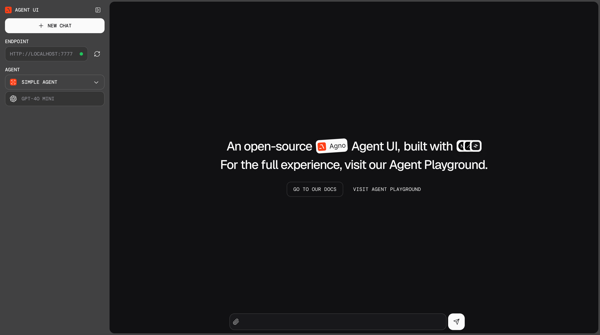

# Agno Agent UI Example with Nebius


This project demonstrates a powerful AI agent interface built with Agno and Nebius, featuring two specialized agents:

- A Web Agent for internet research and information gathering
- A Finance Agent for stock market analysis and financial data

## Features

- Interactive UI for interacting with AI agents
- Web search capabilities using DuckDuckGo
- Financial data analysis using YFinance
- Conversation history tracking
- Markdown formatting support
- SQLite storage for persistent conversations

## Prerequisites

- Python 3.8+
- Nebius API key
- Node.js and npm (for UI)

## Setup

1. Clone the repository:

```bash
git clone https://github.com/Arindam200/awesome-ai-apps.git
cd simple_ai_agent/agno_ui_agent
```

2. Install Python dependencies:

```bash
pip install -U openai duckduckgo-search yfinance sqlalchemy 'fastapi[standard]' agno
```

3. Set up environment variables:
   Create a `.env` file in the project root and add your Nebius API key:

```
NEBIUS_API_KEY=your_api_key_here
```

4. Install and run the Agent UI:

```bash
npx create-agent-ui@latest
cd agent-ui && npm run dev
```

Open http://localhost:3000 to view the Agent UI.



5. Start the Python backend:

```bash
python playground.py
```

## Usage

1. Open http://localhost:3000 in your browser
2. Select the http://localhost:7777 endpoint
3. Choose between the Web Agent or Finance Agent
4. Start interacting with your chosen agent

### Web Agent

- Performs web searches
- Provides information with sources
- Maintains conversation history

### Finance Agent

- Retrieves stock prices
- Provides analyst recommendations
- Displays company information
- Shows relevant company news
- Presents data in formatted tables

## Configuration

The agents are configured in `playground.py` with the following features:

- Conversation history tracking (last 5 responses)
- Markdown formatting
- SQLite storage for persistence
- Automatic datetime inclusion
- Custom instructions for each agent

> 💡 Note: Make sure the serve_playground_app() points to the file containing your Playground app.

## Resources

- [Agno Docs](https://docs.agno.com/agent-ui/introduction)
