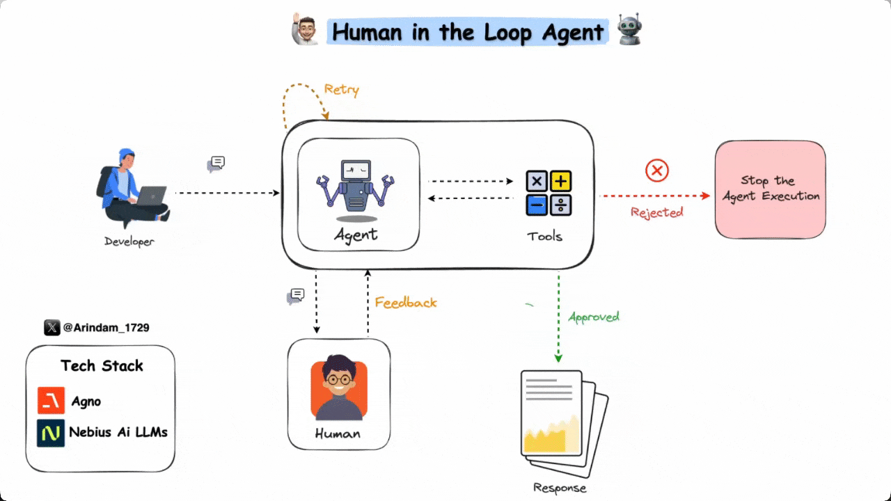

# Human in the Loop Agent

A Python-based AI agent that demonstrates human-in-the-loop interaction, allowing users to control and validate AI actions before they are executed.

This agent is designed to share fun content (facts, quotes, and jokes) while maintaining human oversight. It implements a pre-execution hook system that requires user approval before any action is taken, ensuring safe and controlled AI operations.

## What is Human-in-the-Loop?



Human-in-the-Loop (HITL) workflows integrate human judgment and oversight into automated processes. These workflows pause at critical points for human review, validation, or decision-making before proceeding. This approach combines the efficiency of automation with human expertise and oversight where it matters most.

## Features

- **Human Verification**: Every action requires explicit user approval
- **Retry Mechanism**: Supports up to 3 retries for failed operations
- **Interactive Console**: Rich text-based interface with clear visual feedback
- **Multiple Content Types**: Can share:
  - Interesting facts
  - Motivational quotes
  - Jokes

## Prerequisites

- Python 3.10
- [Nebius API key](https://studio.nebius.com/?modals=create-api-key) (set in .env file)

## Setup

1. Clone the repository
2. Install dependencies:
   ```bash
   pip install -r requirements.txt
   ```
3. Create a `.env` file with your Nebius API key:
   ```
   NEBIUS_API_KEY=your_api_key_here
   ```

## Usage

Run the agent using:

```bash
python main.py
```

The agent will:

1. Present the proposed action
2. Show the arguments to be used
3. Ask for your approval with options:
   - `y`: Proceed with the action
   - `n`: Cancel the action
   - `retry`: Retry with new data (up to 3 times)

## Implementation Details

The agent uses:

- The Nebius LLM model (meta-llama/Llama-3.3-70B-Instruct)
- Pre-execution hooks for action verification
- Rich console output for better user experience
- Iterator-based response streaming

## Error Handling

- Maximum retry limit of 3 attempts
- Graceful cancellation support
- Clear error messages and status indicators

## References

This implementation is based on the following Agno documentation:

- [Human in the Loop](https://docs.agno.com/examples/getting-started/human-in-the-loop) - Documentation for implementing human validation in agent workflows
- [Retry Functions](https://docs.agno.com/examples/getting-started/retry-functions) - Documentation for implementing retry mechanisms in agent functions
