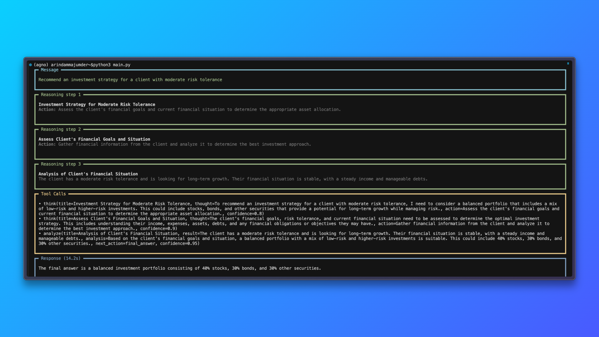

# Simple Reasoning Agent

This project demonstrates a reasoning agent that acts as an expert financial advisor, capable of breaking down complex investment questions and providing structured, step-by-step recommendations.

## Features

- **Expert Financial Reasoning**: The agent specializes in investment strategies, risk assessment, and portfolio recommendations.
- **Step-by-Step Explanations**: Each response is broken down into clear reasoning steps, showing the agent’s thought process.
- **Tool-Enhanced Reasoning**: Uses explicit tool calls to analyze and justify recommendations.
- **Transparent Output**: Shows intermediate reasoning, tool calls, and the final answer in a readable format.

## How It Works

The agent is powered by the [agno](https://github.com/agnos-ai/agno) framework and uses the Nebius Llama-3.3-70B-Instruct model. It is configured to:

- Break down questions into component parts
- State assumptions and key variables
- Develop structured reasoning paths
- Evaluate evidence and consider alternatives
- Provide well-justified, balanced investment advice

## Example

Running the agent with the prompt:

> Recommend an investment strategy for a client with moderate risk tolerance

Produces a detailed, step-by-step reasoning process and a final recommendation, as shown below:



## Usage

1. **Install dependencies** (ensure you have Python 3.8+ and [agno](https://github.com/agnos-ai/agno)):
   ```bash
   pip install agno python-dotenv
   ```

2. **Set your Nebius API key** in a `.env` file:
   ```
   NEBIUS_API_KEY=your_api_key_here
   ```

3. **Run the agent**:
   ```bash
   python3 main.py
   ```

4. **View the output**: The agent will print its reasoning and final answer to the terminal.

## Customization

- Edit the `instructions` in `main.py` to change the agent’s expertise or reasoning style.
- Modify the prompt to ask different financial or investment questions.

## File Structure

- `main.py` — Main entry point for the reasoning agent.
- `README.md` — Project documentation.
- `demo.png` — Example output screenshot.
