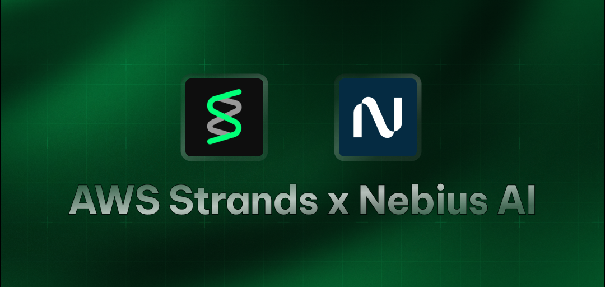

# AWS Strands Starter Agent

A simple demonstration of using the Strands library with Nebius Studio's API to create an AI assistant that can fetch weather information.

## Features

- Custom AI assistant using Nebius's LLMs with the Strands library.
- Weather forecasting capability using the National Weather Service API.
- Demonstrates using `http_request` tool for making external API calls.

## Prerequisites

- Python 3.12+
- [uv](https://github.com/astral-sh/uv) - an extremely fast Python package installer and resolver.
- [Nebius API key](https://dub.sh/nebius)

## Environment Variables

The application requires the following environment variable. You can create a `.env` file in the project root to store it.

- `NEBIUS_API_KEY`: Your Nebius Studio API key.

## Installation

1.  Clone this repository.

    ```bash
    git clone "https://github.com/Arindam200/awesome-ai-apps.git

    cd starter_ai_agents/aws_strands_starter
    ```
2.  Create a virtual environment and install dependencies using `uv`:

    ```bash
    # Create a virtual environment
    uv venv

    # Activate the virtual environment
    source .venv/bin/activate

    # Install dependencies from pyproject.toml and uv.lock
    uv sync
    ```

3.  Create a `.env` file and add your `NEBIUS_API_KEY`.

    ```
    NEBIUS_API_KEY="your-nebius-api-key"
    ```

## Usage

Run the main script:

```bash
uv run main.py
```

The script will:

1.  Create a weather assistant agent.
2.  Ask the agent to compare the temperature in New York and Chicago for the upcoming weekend.
3.  Output the assistant's response.

## Customization

You can modify the `main.py` file to:

- Change the assistant's `system_prompt`.
- Add more tools from `strands_tools` or your own custom tools.
- Alter the example query passed to the `weather_agent`.
- Configure different LLM models supported by LiteLLM.
