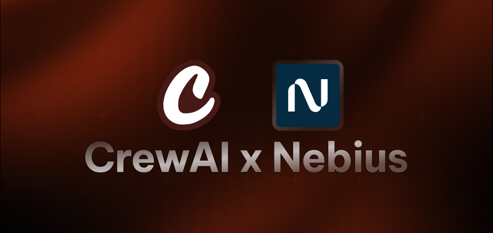

# CrewAI Starter Agent

A powerful AI research crew built with CrewAI that leverages multiple specialized agents to discover and analyze groundbreaking technologies. This project uses the Nebius AI model to deliver intelligent research and analysis of emerging tech trends.

## Features

- 🔬 **Specialized Research**: Dedicated researcher agent focused on discovering groundbreaking technologies
- 🤖 **Intelligent Analysis**: Powered by Meta-Llama-3.1-70B-Instruct model for deep insights
- 📊 **Structured Output**: Well-defined tasks with clear expected outputs
- ⚡ **Sequential Processing**: Organized task execution for optimal results
- 💡 **Customizable Crew**: Easy to extend with additional agents and tasks

## Prerequisites

- Python 3.10 or higher
- Nebius API key (get it from [Nebius AI Studio](https://studio.nebius.ai/))

## Installation

1. Clone the repository:

```bash
git clone https://github.com/Arindam200/awesome-ai-apps.git
cd starter_ai_agents/crewai_starter
```

2. Install dependencies:

```bash
pip install -r requirements.txt
```

3. Create a `.env` file in the project root and add your Nebius API key:

```
NEBIUS_API_KEY=your_api_key_here
```

## Usage

Run the research crew:

```bash
python main.py
```

The crew will execute the research task and provide insights about emerging AI trends.

### Example Tasks

- "Identify the next big trend in AI"
- "Analyze emerging technologies in quantum computing"
- "Research breakthroughs in sustainable tech"
- "Investigate future of human-AI collaboration"
- "Explore cutting-edge developments in robotics"

## Technical Details

The crew is built using:

- CrewAI framework for multi-agent systems
- Nebius AI's Meta-Llama-3.1-70B-Instruct model

### Task Structure

Tasks are defined with:

- Clear description
- Expected output format
- Assigned agent
- Sequential processing

## Contributing

Contributions are welcome! Please feel free to submit a Pull Request.

## Acknowledgments

- [CrewAI Framework](https://github.com/joaomdmoura/crewAI)
- [Nebius AI](https://studio.nebius.ai/)
