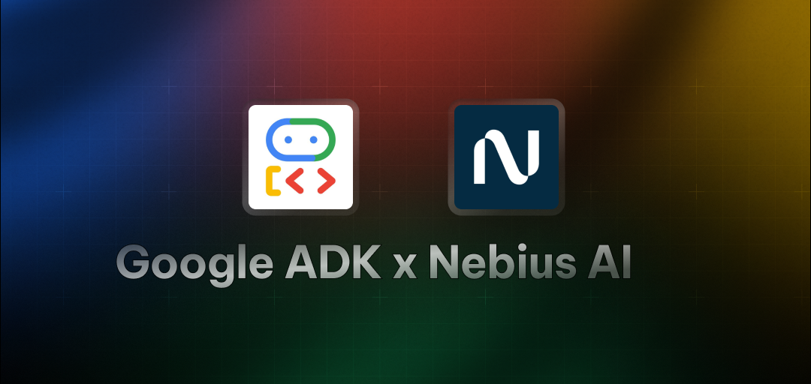

# Google ADK Starter Agent

A simple agent demonstrating email integration with ADK. Built using Google's Agent Development Kit (ADK) framework.

## Overview

This agent showcases:
- Integration with Resend API for sending emails
- How to structure and format email content
- Implementing external APIs with ADK agents
- Foundation for building notification systems

## Technical Pattern

Uses a single agent with a specialized tool:
- **EmailAgent**: Uses the `send_email` tool to send emails via Resend

## Installation

1. Install dependencies:
```bash
pip install -r requirements.txt

# Verify ADK installation
adk --version
```

2. Set up environment variables:
```bash
cp .env.example .env
```

3. Edit the `.env` file with your API keys:
```
NEBIUS_API_KEY="your_nebius_api_key_here"
NEBIUS_API_BASE="https://api.studio.nebius.ai/v1"
RESEND_API_KEY="your_resend_api_key_here"
```

## Usage

Run with ADK CLI:
```bash
# Terminal - Run directly in the terminal
adk run email_adk_agent

# Dev UI - Visual interface for testing and debugging
adk web
```

## Required API Keys

- [Nebius AI](https://dub.sh/AIStudio) - For LLM inference
- [Resend](https://resend.com/) - For email sending

## Customization

To customize the email content, modify the `send_email` function in `agent.py`:

```python
params = {
    "from": "Your Name <your@email.com>",
    "to": ["recipient@email.com"],
    "subject": "Custom Email Subject",
    "html": "<p>Your custom email content here</p>",
}
``` 