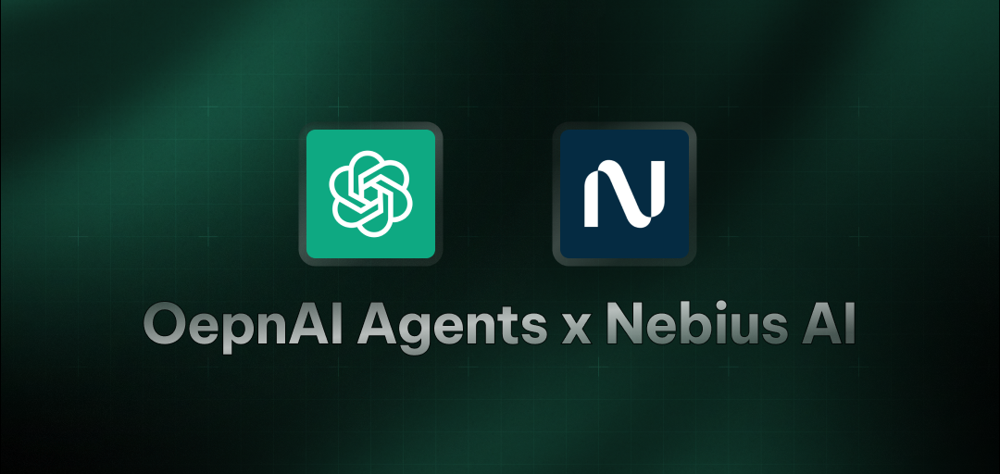

# OpenAI Agents SDK Starter Agent

A simple demonstration of using OpenAI's Agents SDK with Nebius Studio's API to create an AI assistant that can send emails.

## Features

- Custom AI assistant using Nebius's LLMs
- Email sending capability using Resend API
- Haiku-speaking assistant as a demonstration

## Prerequisites

- Python 3.8+
- Nebius API key
- Resend API key
- A verified sender email for Resend

## Environment Variables

The application requires the following environment variables:

- `NEBIUS_API_KEY`: Your Nebius Studio API key
- `RESEND_API_KEY`: Your Resend API key
- `EXAMPLE_BASE_URL`: Nebius API base URL (defaults to "https://api.studio.nebius.ai/v1")
- `EXAMPLE_MODEL_NAME`: Model to use (defaults to "meta-llama/Meta-Llama-3.1-8B-Instruct")

## Installation

1. Clone this repository
2. Install the required dependencies:

```bash
pip install -r requirements.txt
```

3. Set up your environment variables

## Usage

Run the main script:

```bash
python main.py
```

The script will:

1. Create an assistant that responds only in haikus
2. Send a test email using the Resend API
3. Output the result

## Customization

Modify the `main.py` file to:

- Change the assistant's instructions
- Add more tools
- Alter the example query
- Configure different LLM models


