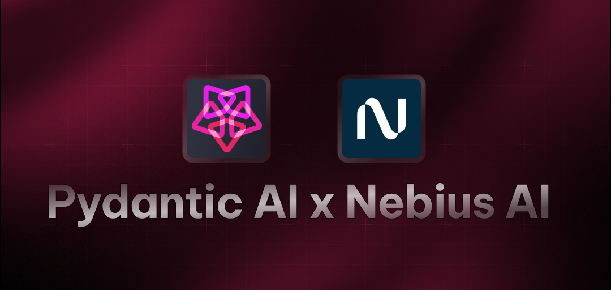

# PydanticAI Starter Agent

A powerful AI agent built with PydanticAI that provides real-time weather information for any city. This agent uses the Nebius AI model to deliver accurate weather forecasts and insights.

## Features

- 🌤️ **Real-time Weather**: Get current weather forecasts for any city worldwide
- 🔍 **Intelligent Search**: Uses DuckDuckGo search to find accurate weather information
- 🤖 **Interactive Interface**: Simple command-line interface for weather queries
- ⚡ **Fast Response**: Quick and accurate weather information delivery
- 🎯 **Customizable**: Easy to modify for different cities and weather-related queries

## Prerequisites

- Python 3.8 or higher
- Nebius API key (get it from [Nebius AI Studio](https://studio.nebius.ai/))

## Installation

1. Clone the repository:

```bash
git clone https://github.com/Arindam200/awesome-ai-apps.git
cd starter_ai_agents/pydantic_starter
```

2. Install dependencies:

```bash
pip install -r requirements.txt
```

3. Create a `.env` file in the project root and add your Nebius API key:

```
NEBIUS_API_KEY=your_api_key_here
```

## Usage

Run the agent:

```bash
python main.py
```

The agent will fetch and display the weather forecast for the specified city (default: Kolkata).

### Example Queries

- "What is the weather forecast for New York today?"
- "What's the temperature in London right now?"
- "Will it rain in Tokyo tomorrow?"
- "What's the weather like in Sydney?"
- "Show me the forecast for Paris"

## Technical Details

The agent is built using:

- PydanticAI framework for AI agent development
- Nebius AI's Meta-Llama-3.1-70B-Instruct model
- DuckDuckGo Search Tool for weather information

## Contributing

Contributions are welcome! Please feel free to submit a Pull Request.

## Acknowledgments

- [PydanticAI Framework](https://ai.pydantic.dev/)
- [Nebius AI](https://studio.nebius.ai/)
